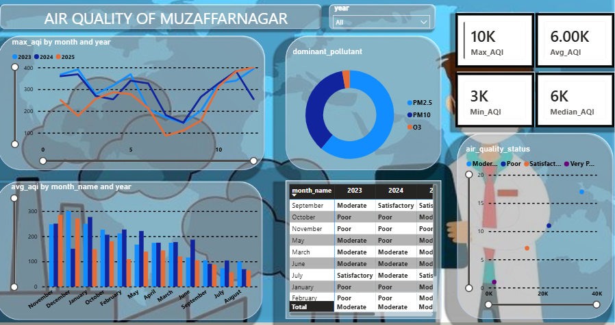

# 🌍 Air Quality Analysis Dashboard – Muzaffarnagar

## 📌 Project Overview

The Air Quality Analysis Dashboard is an interactive Business Intelligence solution developed in Power BI to analyze air quality trends in Muzaffarnagar, Uttar Pradesh.

The dashboard transforms raw environmental data into meaningful insights by tracking Air Quality Index (AQI), identifying dominant pollutants, and monitoring air quality patterns over time.

This project demonstrates data cleaning, transformation, modeling, DAX calculations, and dashboard development skills using Power BI.

---

## 🎯 Objective

The primary objective of this project is to:

* Monitor Air Quality Index (AQI) trends.
* Identify dominant pollutants affecting air quality.
* Analyze monthly and yearly pollution patterns.
* Create an interactive dashboard for data-driven decision making.
* Present environmental data in a visually appealing and understandable format.

---

## 📊 Dashboard Features

### KPI Cards

* Maximum AQI
* Minimum AQI
* Average AQI
* Median AQI

### AQI Trend Analysis

* Monthly AQI trend visualization
* Year-over-year comparison
* Seasonal pollution analysis

### Pollutant Analysis

* Dominant pollutant identification
* Pollutant distribution insights

### Air Quality Status Distribution

Classification based on AQI categories:

* Good
* Satisfactory
* Moderate
* Poor
* Very Poor
* Severe

### Interactive Filtering

* Year-wise filtering
* Dynamic slicers
* Interactive visual exploration

---

## 🛠️ Tools & Technologies Used

| Technology         | Purpose                        |
| ------------------ | ------------------------------ |
| Power BI           | Dashboard Development          |
| Power Query        | Data Cleaning & Transformation |
| DAX                | Calculated Measures            |
| Excel / CSV        | Data Source                    |
| Data Modeling      | Relationship Management        |
| Data Visualization | Reporting & Insights           |

---

## 📂 Dataset Information

The dataset contains air quality observations for Muzaffarnagar, including:

* Date
* Year
* Month
* AQI Value
* Air Quality Status
* Dominant Pollutant

---

## 🔄 Project Workflow

### 1. Data Collection

Collected and imported air quality data into Power BI.

### 2. Data Cleaning

Performed data preprocessing using Power Query:

* Removed inconsistencies
* Corrected data types
* Standardized columns
* Handled missing values

### 3. Data Transformation

Created analytical fields such as:

* Year
* Month
* Date hierarchy

### 4. Data Modeling

Developed an optimized data model for efficient reporting and analysis.

### 5. DAX Calculations

Created measures for:

* Average AQI
* Maximum AQI
* Minimum AQI
* Median AQI

### 6. Dashboard Development

Designed an interactive dashboard using:

* KPI Cards
* Bar Charts
* Pie Charts
* Line Charts
* Slicers

---

## 📈 Key Insights

* AQI levels fluctuate significantly across different months.
* Certain pollutants contribute more frequently to poor air quality.
* Seasonal changes have a noticeable impact on pollution levels.
* Historical AQI trends help identify periods of environmental concern.

---

## 🖼️ Dashboard Preview

---

## 🚀 Future Improvements

* Real-time AQI monitoring
* Machine Learning based AQI forecasting
* Comparative analysis with nearby cities
* Mobile-optimized dashboard design

---

## 💡 Skills Demonstrated

* Data Cleaning
* Data Transformation
* Data Modeling
* DAX Measures
* Dashboard Design
* Data Visualization
* Business Intelligence
* Analytical Thinking

---

## 📁 Repository Structure

Air-Quality-Muzaffarnagar-Power-BI/

├── README.md

├── Dashboard/

│ └── Air_Quality_Dashboard.pbix

├── Dataset/

│ └── air_quality_data.csv

├── Images/

│ └── dashboard_overview.png

---

## 👨‍💻 Author

Nikhil Kumar

Aspiring Data Analyst | Power BI Developer | Data Science Enthusiast

GitHub: https://github.com/nikhilkumar7512

---

⭐ If you found this project useful, consider giving it a star.
